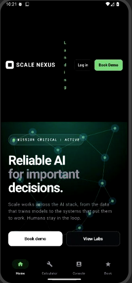

# Scale Nexus



[](https://developer.android.com)
[](https://kotlinlang.org)
[](https://developer.android.com/jetpack/compose)
[](https://opensource.org/licenses/MIT)

Scale Nexus is a high-frontier **AI Evaluation, Data Scaling, and Cluster Infrastructure Operations Console** built natively for Android. Featuring an **Immersive UI** design theme, it streamlines tracking AI model training data, human-in-the-loop consensus scores, and active compute metrics in a centralized, secure environment.

---

## 🎨 Design Concept: The Immersive UI

Scale Nexus utilizes a customized Material 3 dark slate identity built on safety-first visual palettes.
- **Backing Canvas**: Absolute rich `#050505` and `#0A0A0A` for infinite contrast ratio.
- **Primary Glow Accent**: Ambient Emerald `#72CE7B` representing mission-critical, stable operations.
- **Secondary Highlights**: Sky Blue `#4CC2FF`, Solar Orange `#FF8552`, and Deep Amethyst `#7C688F` for distinct categorical visual scanning.
- **Radial Lighting**: Sophisticated programmatic radial gradients projecting back-glow filters across the layout viewport, mimicking active server indicators.

---

## 🚀 Key Functional Modules

### 1. Centralized Nexus AI Evaluation Dashboard
A highly responsive quality assurance terminal displaying real-time task evaluation results.
* **Multi-Project Matrix Router**: Clickable segment tabs toggle between separate dataset evaluation nodes:
  * *Nexus-V5 Core LLM*
  * *Aviation AV-NET Multi-Camera Segmenters*
  * *Defense Tactical Speech-V9*
* **Progress Performance Gauges**: High-fidelity custom progress meters monitoring human consensus matching (RLHF), safety/toxicity pass barriers, and token inference response latency.
* **Interactive Quality Filter**: Interactive threshold chips (70% - 95%) let you dynamically model and simulate production pass rates and calculate exact task counts.
* **Granular Telemetry Switch**: Uses interactive-state flag triggers (the React equivalent of local state in Compose) to expand or collapse highly advanced metric summaries like Pearson R ground-truth correlations and GPU execution index pricing.

### 2. Live Enterprise Management Console
A restricted engineering portal displaying system operations with live-simulated stats:
* **Real-Time KPI Tracking**: Dynamically increments GPU cluster throughput (T/s) and human labeler feedback counts in the background using Kotlin Coroutines and Flows.
* **Active Cluster Runs**: Lists active compilation jobs, gradient alignment status, and remaining runtime targets.
* **GPU Compute Farms**: Tracks multi-region H100 and A100 rack layout utilization indices with green heartbeat active-state visuals.
* **UTC Infrastructure Logs**: Standard terminal logging tracing consensus aggregations and worker deployment events.

### 3. ROI Optimization Calculator
A predictive modeling workspace for AI architects to estimate the financial efficiency of utilizing Scale Nexus over traditional infrastructure:
* Dynamic human feedback volume adjustments.
* Parameter validation sliders matching training model sizing requirements.
* Automatic generation of precise financial charts with detailed calculations on accuracy gain percentiles and estimated budget savings.

### 4. Interactive Enterprise Booking Sheets
A clean, sliding modal consultation generator enabling users to request on-site cluster audits:
* **Custom Dropdown Boxes**: Interactive styled choice lists for selected use-cases and training token capacities.
* **Immediate Form Validity**: Rich visual warnings if essential input fields (Org, Name, corporate email) are omitted.

---

## 🛠️ Technology Architecture

* **Framework**: Native Jetpack Compose following clean Model-View-ViewModel (MVVM) patterns.
* **State Engines**: Programmed using Compose State APIs (`remember`, `mutableStateOf`) supporting smooth, instant UI reactivity.
* **Concurrency**: Powered by Kotlin Coroutines (`delay`, `LaunchedEffect`) for mock-free real-time calculations.
* **Immersive Styling**: Integrated with status bars with full `WindowInsets` handling, high-contrast Material Symbols, modern ripples, and custom Canvas draw wrappers.

---

## 📦 Getting Started & Build Instructions

### Prerequisites
* **Android Studio** (Koala or newer)
* **JDK 17** or above
* **Gradle 8.4** or above

### Installation of Source Files
1. Clone the repository to your desktop machine:
```bash
git clone https://github.com/your-username/scale-nexus.git
cd scale-nexus
```

2. Open the project folder in Android Studio.
3. Allow the IDE to sync dependencies using the Version Catalog (`gradle/libs.versions.toml`).

### Programmatic Compilation via Terminal
To build a debug-ready APK of Scale Nexus from the terminal window, execute:
```bash
gradle assembleDebug
```

To run Kotlin compiler verification tasks, execute:
```bash
gradle compileDebugKotlin
```

---

## 📝 Folder Layout

```text
/
├── app/
│   ├── src/main/
│   │   ├── java/com/example/
│   │   │   ├── MainActivity.kt        # Combined High-Fidelity Views and State logic
│   │   │   └── ui/theme/
│   │   │       ├── Color.kt           # Immersive UI Hex Palette Declarations
│   │   │       ├── Theme.kt           # Custom Material 3 Scaling Schemes
│   │   │       └── Type.kt            # Typography System Rules
│   │   ├── res/
│   │   │   ├── values/strings.xml     # Application Name Resource [Scale Nexus]
│   │   │   └── VALUES-V21/            # High SDK Theme Overrides
│   │   └── AndroidManifest.xml        # Runtime permissions and activity entries
│   └── build.gradle.kts               # Module level dependencies and plugins
├── metadata.json                      # AI Studio platform configuration settings
├── gradle/                            # Gradle wrapper libraries and Version Catalog
└── settings.gradle.kts                # Project level build definitions
```

---

## ⚖️ License

Distributed under the MIT License. See `LICENSE` for more information.
